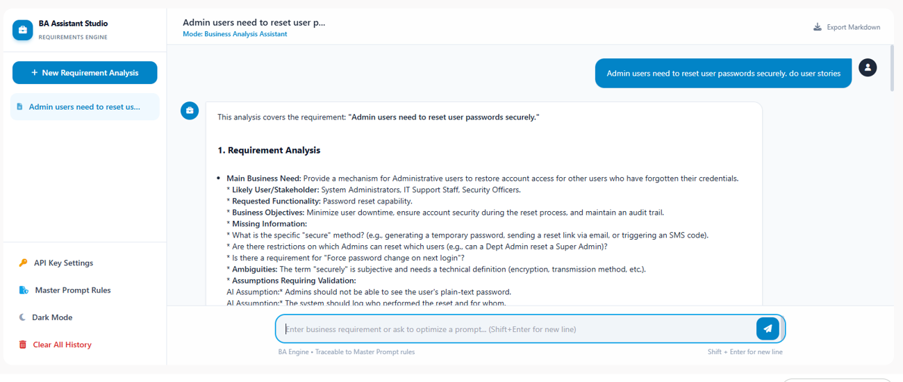
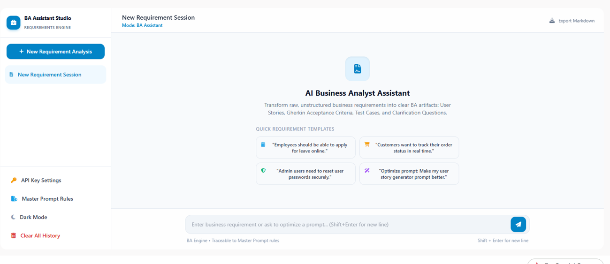
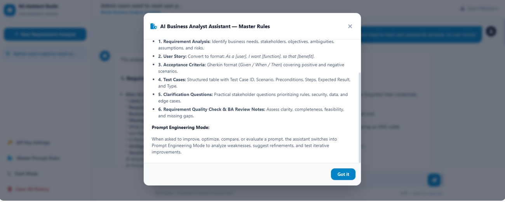

# AI Business Analyst Assistant

Week 2 project, CAPACITI x Clickatell AI Bootcamp (April 2026).

An AI assistant that turns a raw business requirement into structured Business Analysis documentation: requirement analysis, user story, acceptance criteria, test cases, stakeholder questions and a quality check. It is driven by a master prompt that tells the model to flag gaps instead of inventing requirements, and the Business Analyst stays responsible for validating everything it produces.

## Contents

* [Project overview](#project-overview)
* [What was built](#what-was-built)
* [Example outputs](#example-outputs)
* [Prompt engineering](#prompt-engineering)
* [Findings](#findings)
* [Human validation](#human-validation)
* [Limitations](#limitations)
* [Documentation](#documentation)

## Project overview

Business Analysts work from information gathered in meetings, emails and conversations. That information has to become structured documentation such as user stories, acceptance criteria, test cases and clarification questions. A stakeholder may say only:

> "Employees should be able to apply for leave online."

The analyst then has to work out who the users are, what information is needed, who approves, what happens when information is missing, and what the negative scenarios are.

This project explores whether a carefully designed prompt can make an AI assistant useful for that work, while keeping the analyst responsible for reviewing and validating the result.

The question it asks: **how can prompt engineering be used to create an AI assistant that helps Business Analysts turn raw requirements into structured documentation?**

## What was built

BA Assistant Studio is a web app (React, TypeScript, Vite, Gemini API) built in Google AI Studio. A Business Analyst types a raw requirement and the assistant returns six outputs, as set out in its master prompt:

1. **Requirement analysis:** business need, stakeholders, objectives, missing information, ambiguities, assumptions and risks
2. **User story** in the format *As a [user], I want [function], so that [benefit]*
3. **Acceptance criteria** in Given / When / Then, with positive and negative scenarios
4. **Test cases** in a table: ID, scenario, preconditions, steps, expected result and type
5. **Clarification questions** for stakeholders
6. **Requirement quality check and BA review notes:** clarity, completeness, testability and feasibility

Other features:

* **Prompt Engineering Mode:** when asked to improve, compare or evaluate a prompt, the assistant analyses its weaknesses and proposes a refined version.
* **Master Prompt Rules:** the rules that govern the assistant can be viewed in the app.
* Quick requirement templates, saved session history, Export Markdown, dark mode and an API key setting.

| | |
| --- | --- |
|  |  |

## Example outputs

Both outputs below were generated by the assistant and exported unedited, apart from Markdown formatting.

| Requirement | Output |
| --- | --- |
| Admin users need to reset user passwords securely | [docs/examples/admin-password-reset.md](docs/examples/admin-password-reset.md) |
| Employees should be able to apply for leave online | [docs/examples/leave-application.md](docs/examples/leave-application.md) |

In both, the assistant listed the unknowns (reset method, leave types, approvers, balances) as missing information and clarification questions instead of choosing for the analyst, and marked unknown rules "Requires clarification".

## Prompt engineering

The assistant runs on one master prompt that sets:

* **Role:** an assistant to the Business Analyst, not a replacement
* **Six outputs** and a fixed output structure
* **Rules:** do not fabricate requirements, do not hide assumptions, keep outputs traceable to the original requirement, prioritise clarification over assumptions, and do not treat AI-generated content as final
* **Handling of ambiguous requirements**, using the leave-application example
* **Prompt Engineering Mode** for improving prompts: **Prompt → Test → Evaluate → Refine → Test Again → Final Prompt**

The full prompt, split into reusable task prompts, is in the [prompt library](docs/prompt-library.md).

## Findings

I tested the master prompt on the two requirements above and evaluated each output against a checklist (assumptions labelled, unknown rules marked, no invented requirements, test cases traced to acceptance criteria, output structure followed). The full evaluation is in [docs/prompt-optimization.md](docs/prompt-optimization.md).

* **Strength:** the assistant reliably identifies missing information and asks relevant stakeholder questions.
* **Weakness 1:** it adds specifics the requirement does not state (for example a "403 Forbidden" error, audit-log fields, a leave balance check).
* **Weakness 2:** some test cases have no matching acceptance criterion.
* **Weakness 3:** the app's headings do not fully match the master prompt's seven sections.

The next step is to refine the prompt to address these, re-run the same two requirements, and compare the two versions. The comparison table is prepared but not yet filled in, because that needs a new run of the refined prompt.

## Human validation

AI-generated content does not become final documentation. The workflow is:

**Requirement → AI Assistant → Generated Output → BA Review → Validation → Final Documentation**

The analyst decides whether the output represents the business requirement. This matters because the model can produce content that is incomplete, wrong, or based on assumptions nobody supplied, and the findings above show it does.

## Limitations

* Output depends on the model and can differ between runs. Two recorded examples are not a test of reliability.
* The assistant drafts; it does not replace stakeholder conversations or the analyst's judgement.
* The prompt refinement and version comparison are planned, not yet run.

## Documentation

* [Case study](docs/case-study.md): problem, approach, build, findings and what I learned
* [Prompt library](docs/prompt-library.md): the master prompt and reusable task prompts
* [Prompt optimization](docs/prompt-optimization.md): evaluation of the outputs, planned refinements and comparison template
* [Example outputs](docs/examples/)

## Links

* Portfolio: [mngadisamu-github-ebg8ypcck-team-ai-1c57.vercel.app](https://mngadisamu-github-ebg8ypcck-team-ai-1c57.vercel.app/)
